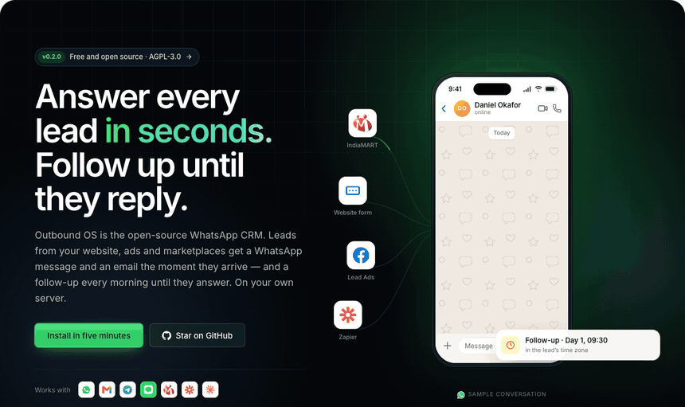
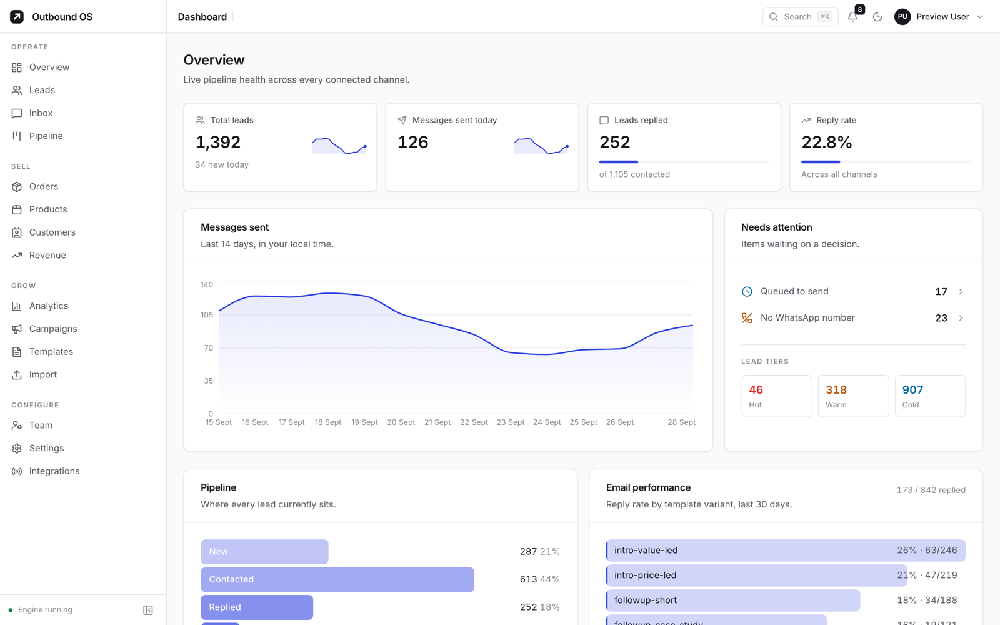
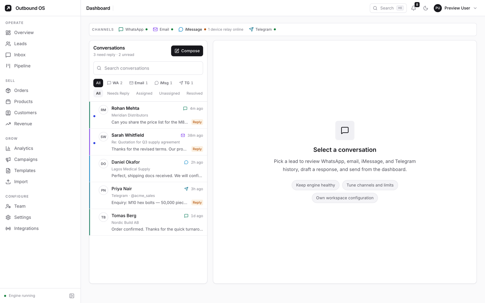
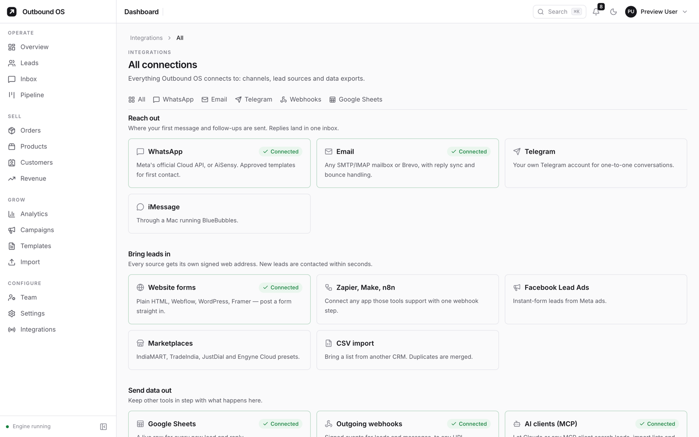
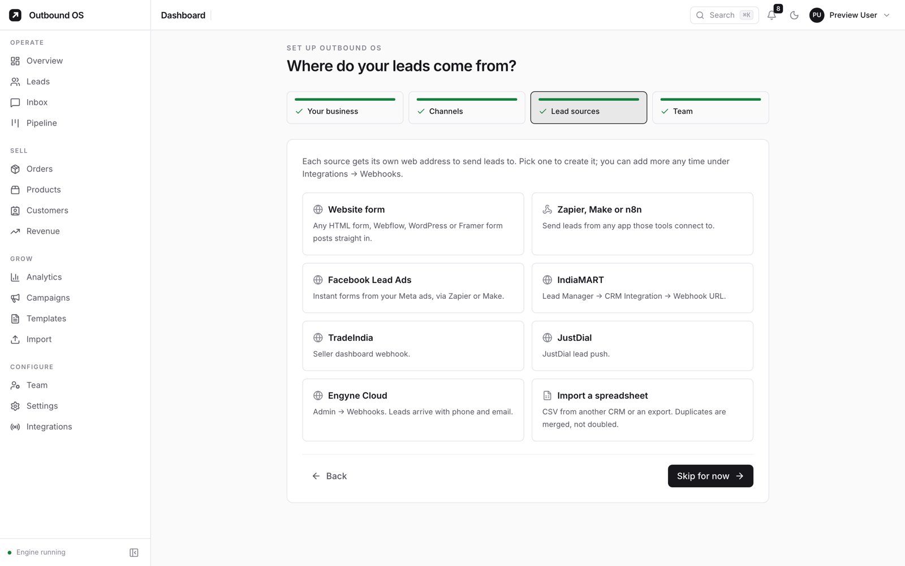
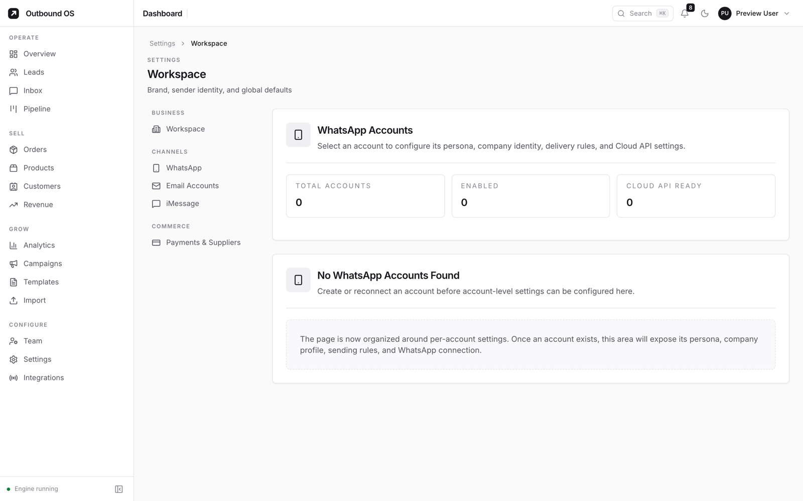

<p align="center">
  
</p>

<h1 align="center">Outbound OS</h1>

<p align="center">
  <strong>The open-source WhatsApp CRM that answers every lead in seconds<br>and follows up until they reply.</strong>
</p>

<p align="center">
  Self-hosted · Meta's official WhatsApp Cloud API · Email, Telegram and iMessage · An MCP server for AI agents
</p>

<p align="center">
  <a href="https://github.com/thatsarpit/outbound-os/actions/workflows/ci.yml"></a>
  <a href="https://github.com/thatsarpit/outbound-os/releases"></a>
  <a href="https://github.com/thatsarpit/outbound-os/pkgs/container/outbound-os"></a>
  <a href="LICENSE"></a>
  <a href="https://outboundos.space"></a>
</p>

<p align="center">
  <a href="https://outboundos.space">Website</a> ·
  <a href="https://outboundos.space/demo"><b>Live demo</b></a> ·
  <a href="https://outboundos.space/docs/install">Install in 5 minutes</a> ·
  <a href="https://outboundos.space/docs">Docs</a> ·
  <a href="https://outboundos.space/mcp">MCP for AI agents</a> ·
  <a href="https://github.com/thatsarpit/outbound-os/discussions">Discussions</a>
</p>

<p align="center">
  
</p>

Leads come in from your website, marketplaces, ad forms and spreadsheets.
Outbound OS puts them in one queue, contacts them within seconds on WhatsApp,
email, Telegram or iMessage, follows up on a schedule, and stops the moment
someone replies. It runs on your own server, and your leads never leave your
database.

**Why it exists.** It was built to run a real export sales desk: enquiries
from IndiaMART and the web at all hours, buyers in dozens of time zones, and
follow-ups that kept slipping. It still runs that desk in production. Now it
is open source, so any team can run their own.

<picture>
  <source media="(prefers-color-scheme: dark)" srcset="docs/screenshots/overview-dark.png">
  
</picture>

<table>
  <tr>
    <td></td>
    <td></td>
  </tr>
  <tr>
    <td align="center"><sub>One inbox for every channel</sub></td>
    <td align="center"><sub>Everything it connects to</sub></td>
  </tr>
  <tr>
    <td></td>
    <td></td>
  </tr>
  <tr>
    <td align="center"><sub>Guided setup on first sign-in</sub></td>
    <td align="center"><sub>Meta Cloud API or AiSensy, per number</sub></td>
  </tr>
</table>

<sub>Screenshots use made-up sample data.</sub>

---

## What it does

- **Instant first touch.** A lead that arrives by webhook is contacted on every
  channel you have connected, straight away — not when someone next opens the
  dashboard.
- **One inbox for every channel.** WhatsApp, email, Telegram and iMessage
  threads sit side by side on the lead they belong to.
- **Follow-ups that know when to stop.** Sequences run in the lead's working
  hours and end on a reply, an opt-out, or a closed deal.
- **Campaigns** to any slice of your leads (by tag, status, country, score),
  with approved WhatsApp templates for anyone outside the 24-hour window.
- **A pipeline, not just messages.** Status, owner, score, notes, tasks,
  orders and shipment updates live on the same record as the conversation.
- **Dashboard layouts for each account.** Reorder, resize and hide Overview
  and Analytics widgets, then save the layout across devices.
  [Dashboard guide](docs/dashboard.md).
- **Built for AI agents.** An MCP server lets Claude or any MCP client search
  leads, import lists, launch campaigns and read replies on your live data.

## What it deliberately doesn't do

- **Bypass channel rules.** WhatsApp goes through Meta's official Cloud API
  (or a Meta partner). Template approval, opt-in and the 24-hour window apply.
  Anything that promises otherwise is asking you to get your number banned.
- **Blast.** Sending limits and warm-up are built in. The design assumes you
  want replies, not volume.

---

## Integrations

| Bring leads in | Reach out | Send data out |
|---|---|---|
| Any website form (HTML, Formspree-style POST, Webflow, WordPress) | **WhatsApp** — Meta Cloud API, or AiSensy | Outgoing webhooks on lead and message events |
| Facebook Lead Ads | **Email** — any SMTP/IMAP inbox, Brevo | Google Sheets (live row sync) |
| IndiaMART, TradeIndia, JustDial (their CRM webhooks) | **Telegram** — your own account | CSV export |
| Engyne Cloud | **iMessage** — via a Mac running BlueBubbles | MCP server for AI clients |
| Zapier, Make, n8n, or your own code (signed webhook) | | |
| CSV / JSON import | | |

Every inbound source is a **signed webhook** with a field map, so a new source
is a settings change, not a code change. Presets exist for the ones above.

### Website forms

Point any HTML form at a lead source — the setup wizard gives you a ready-made
one — and it works like a hosted form backend:

```html
<form action="https://your-host/api/webhooks/inbound/<source>?apiKey=<key>" method="post">
  <input name="name" required>
  <input name="email" type="email">
  <input name="phone">
  <textarea name="message"></textarea>
  <label><input type="checkbox" name="email_consent" value="yes"> Email me updates</label>
  <input type="text" name="_gotcha" style="display:none" tabindex="-1" autocomplete="off">
  <input type="hidden" name="_next" value="https://your-site.com/thanks">
  <button>Send</button>
</form>
```

- `_gotcha` is a spam trap: bots fill it, people never see it, and those
  submissions are dropped.
- `_next` sends the visitor back to a page on your own site; without it they
  see a short thank-you page.
- A ticked `email_consent` (or `marketing_consent`, `newsletter`) records
  marketing consent with its time and source. Unticked means no consent.
- JSON posts from Zapier, Make, n8n or your own code use the same address, with
  the key in an `x-api-key` header.

---

## Quick start (Docker)

You need a machine with Docker. A 1–2 GB VM is plenty for a small team, on
Intel or ARM.

```bash
git clone https://github.com/thatsarpit/outbound-os.git
cd outbound-os
cp .env.example .env          # set ADMIN_EMAIL; everything else can wait
docker compose up -d          # pulls the published image; nothing to build
```

Open <http://localhost:3001> and sign in as `ADMIN_EMAIL`. If you did not set
`ADMIN_PASSWORD`, the first boot prints a generated one:

```bash
docker compose logs app | grep "First admin"
```

Then connect channels in **Settings → WhatsApp**, **Settings → Email** and
**Integrations**. Nothing sends until you do.

Put it behind HTTPS (Caddy, Nginx, Cloudflare Tunnel) before connecting
WhatsApp: Meta only delivers webhooks to a public HTTPS address.

### Deploy on Render

[](https://render.com/deploy?repo=https%3A%2F%2Fgithub.com%2Fthatsarpit%2Foutbound-os)

The included `render.yaml` pulls the published image and mounts a persistent
disk at `/app/data`. This requires a **paid service and disk**. Enter
`ADMIN_EMAIL` when Render prompts, then open the service's HTTPS URL. In
Render's **Logs**, search for `First admin created` to find the generated
password; change it after signing in. Keep the disk attached when redeploying:
both the SQLite database and generated credential keys live there. Pin a
released image tag in your fork's Blueprint when you want controlled upgrades.
The [install guide](https://outboundos.space/docs/install#render) has the steps.

### Your data

Everything is in the `outboundos-data` Docker volume: the SQLite database and
`instance-secrets.json`, the generated keys that sign sessions and encrypt
saved credentials. **Back up both together** — the database's stored
credentials cannot be decrypted without that file.

```bash
docker compose exec app bash scripts/backup.sh
docker compose cp app:/app/data/backups ./backups
```

### Updating

```bash
git pull
docker compose pull && docker compose up -d
```

Compose runs the published images from GitHub Container Registry
(`ghcr.io/thatsarpit/outbound-os`, amd64 and arm64). Pin a version with
`OUTBOUNDOS_VERSION=0.2.0` in `.env`. Database migrations run automatically
on start. Running your own changes? `docker compose up -d --build` builds
from this folder instead.

---

## Connecting WhatsApp (Meta Cloud API)

1. Create an app at [developers.facebook.com](https://developers.facebook.com)
   and add the **WhatsApp** product. Add your number under **API Setup**.
2. Create a **System User** in Meta Business Settings, give it the
   `whatsapp_business_messaging` permission, and generate a permanent token.
3. In Outbound OS: **Settings → WhatsApp → Meta Cloud API**, paste the
   **Phone number ID** and the **token**, then **Test connection**.
4. To receive replies, set `META_APP_SECRET` and `META_WEBHOOK_VERIFY_TOKEN`
   in `.env`, then in Meta: **WhatsApp → Configuration → Webhook**, callback
   `https://your-host/webhook/meta`, the same verify token, and subscribe to
   **messages**.

First contact must use an **approved template**. Put its name on a campaign
(or as a number's default) and Outbound OS fills `{{1}}` with the lead's first
name and `{{2}}` with their country.

Already on AiSensy? Pick **AiSensy** instead and paste your API Campaign key.

---

## Configuration

Only these matter to boot; everything else is a channel you opt into. The full
list, with explanations, is in [`.env.example`](.env.example).

| Setting | Default | What it does |
|---|---|---|
| `ADMIN_EMAIL` / `ADMIN_PASSWORD` | generated | The first admin, created on first boot |
| `AUTH_PROVIDER` | `local` | `local` = email + password; `clerk` = Clerk-hosted sign-in |
| `BUSINESS_NAME`, `BUSINESS_WEBSITE`, … | — | Your identity in outgoing messages and emails |
| `BUSINESS_TIMEZONE` | `UTC` | When "today" starts; daily limits and reports use it |
| `DEFAULT_COUNTRY_CODE` | — | Calling code added to numbers typed without one (1, 44, 91…) |
| `BUSINESS_CURRENCY` | `USD` | Currency for supplier costs, profit and reports |
| `META_APP_SECRET`, `META_WEBHOOK_VERIFY_TOKEN` | — | Receiving WhatsApp replies from Meta |
| `CORS_ORIGIN` | — | Only if the dashboard is served from another origin |

`JWT_SECRET` and `LEAD_SYNC_ENCRYPTION_KEY` are generated on first boot if you
leave them blank. Business details, time zone, country code and currency can
also be set in the setup wizard or **Settings → Workspace**; values saved there
win over `.env`.

---

## Development

```bash
cp .env.example .env
npm ci && npm ci --prefix web
npx prisma migrate deploy      # creates data/outboundos.db
npm run dev --prefix web       # dashboard on :5173, proxies /api
npm start                      # API on :3001
```

```bash
npm test                       # unit tests
npm run test:integration       # API tests against a throwaway database
npm run lint --prefix web && npm run build --prefix web
```

The live demo is the same dashboard on sample data with no server behind
it: `npm run build:demo --prefix web` builds it into `web/dist-demo`, and
the sample data lives in `web/src/demo/`. In development, `/dev/shell`
shows the same data.

| Path | What lives there |
|---|---|
| `src/` | Node/Express API, services, scheduled jobs |
| `src/services/whatsappProviders.js` | What each WhatsApp provider needs |
| `web/` | React + Vite dashboard |
| `prisma/` | Schema and migrations (SQLite) |
| `mcp-outboundos/` | MCP server (`docker compose --profile mcp up -d`) |
| `android/` | Native Android companion app |
| `test/` | Unit and integration tests |

Adding a lead source or a channel? Read
[`docs/integrations.md`](docs/integrations.md) first.

## AI agents (MCP)

Outbound OS ships an [MCP](https://modelcontextprotocol.io) server, so Claude
and other AI clients can search leads, import lists, build and start
campaigns, and read analytics on your live data — with your approval on
anything that sends.

```bash
# .env: MCP_SERVICE_TOKEN and MCP_BEARER_TOKEN (openssl rand -hex 32 each)
docker compose --profile mcp up -d
claude mcp add --transport http outbound-os https://mcp.your-host.com/mcp \
  --header "Authorization: Bearer <MCP_BEARER_TOKEN>"
```

claude.ai and the Claude apps connect as a custom connector through OAuth.
Full guide and the list of tools: [outboundos.space/mcp](https://outboundos.space/mcp).

## Contributing

Contributions are welcome — code, docs, translations, bug reports.

- Start with an issue labelled
  [`good first issue`](https://github.com/thatsarpit/outbound-os/issues?q=is%3Aissue+is%3Aopen+label%3A%22good+first+issue%22).
- Read [`CONTRIBUTING.md`](CONTRIBUTING.md); coding agents and their users,
  [`AGENTS.md`](AGENTS.md).
- Questions and ideas go to [Discussions](https://github.com/thatsarpit/outbound-os/discussions).
- Comparing options? [How Outbound OS compares](https://outboundos.space/alternatives)
  with hosted WhatsApp platforms, stated fairly.

## Security

**Please do not open a public issue for a vulnerability.** See
[`SECURITY.md`](SECURITY.md) for private disclosure.

Self-hosting means the obligations that come with contact data and messaging
are yours: keep `.env` and backups private, rotate credentials, and follow the
consent and record-keeping rules where you operate.

## License

[AGPL-3.0](LICENSE). Use, modify and self-host it freely, including
commercially. If you run a modified version as a network service, you must
make your changes available under the same license.
